# Voice Assistant Interface Design Examples

## **Example Screenshots and Descriptions**

### Amazon Alexa


Video by Amazon Alexa


<figure>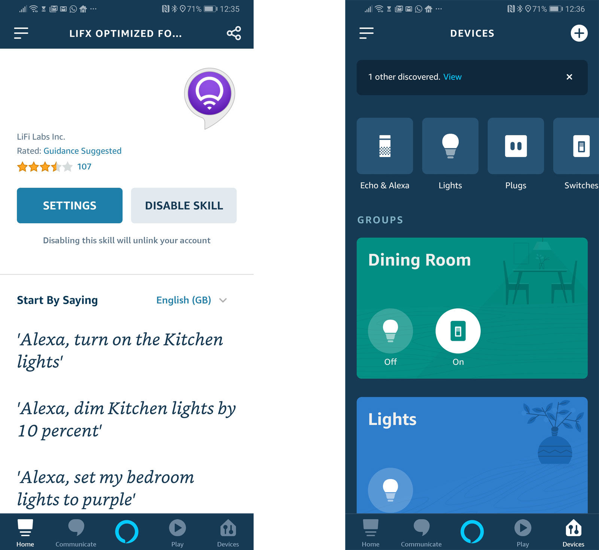<figcaption>
Alexa Skills and Interface
</figcaption></figure>

 

<figure>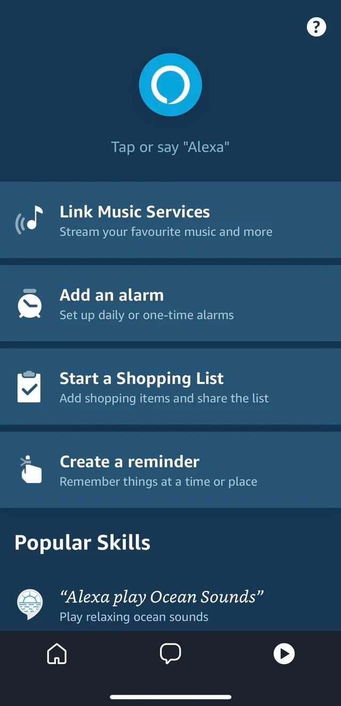<figcaption>
Suggested Prompts
</figcaption></figure>

 

<figure>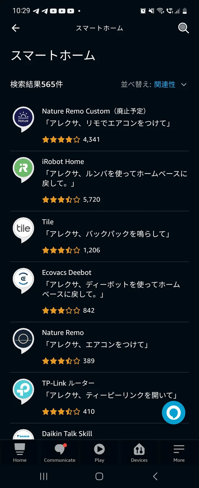<figcaption>
Alexa Skill Store
</figcaption></figure>

<figure>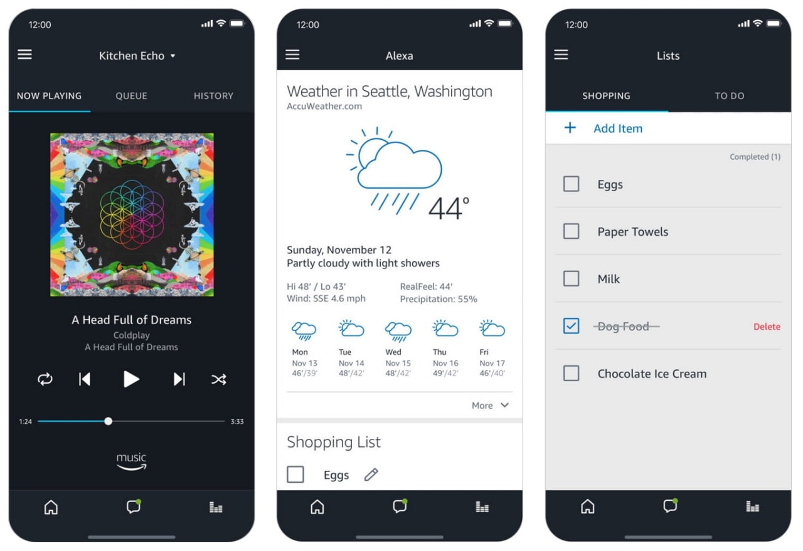<figcaption>
Music, Weather, Shopping List Display
</figcaption></figure>

 

<figure>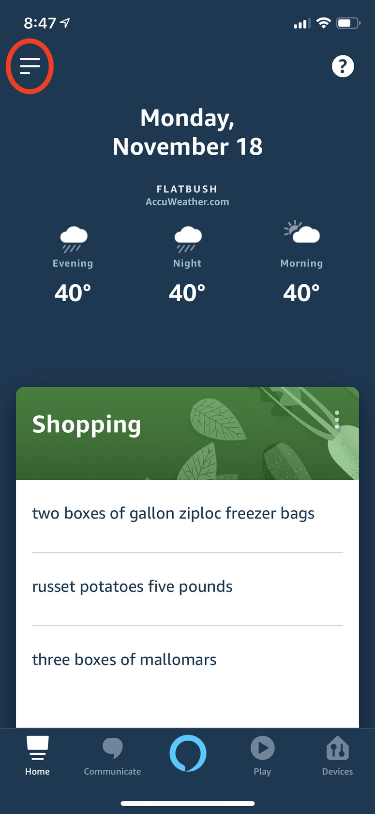<figcaption>
Home screen - Customizable
</figcaption></figure>

 

<figure>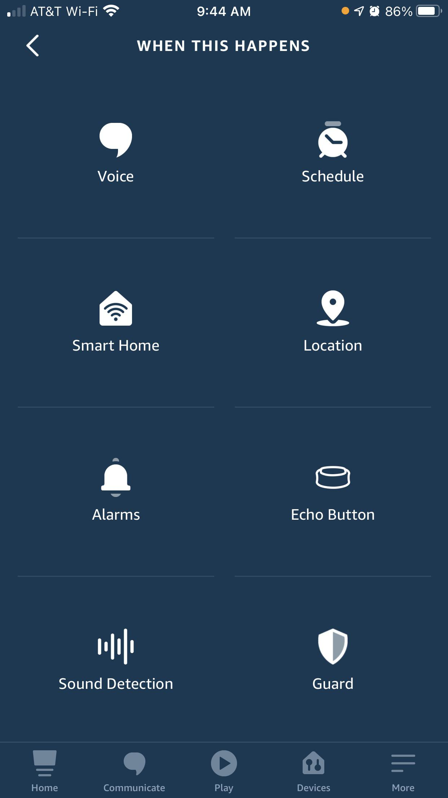<figcaption>
More Features List
</figcaption></figure>

### Walmart Ask Sam


Video by CBS Philadelphia


[**Features:**](https://corporate.walmart.com/news/2020/07/29/helping-associates-succeed-at-work-while-elevating-customer-service-safety)

* Store Maps
* Price Look-up
* Product Locator
* Check Email
* Store Sales Information
* Printing
* Birthdays / Anniversaries

<figure>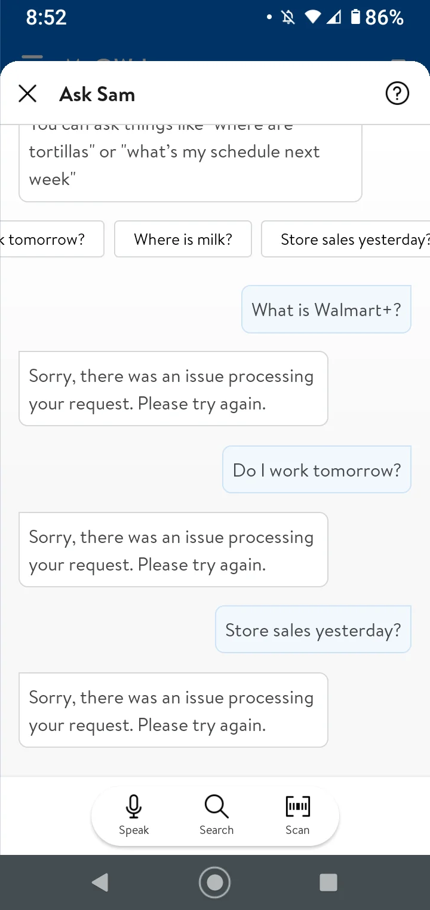<figcaption>
Text Conversation
</figcaption></figure>

 

<figure>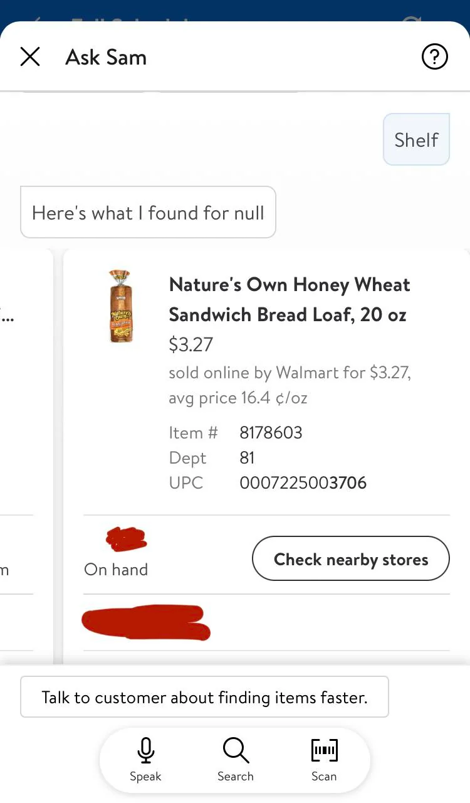<figcaption>
Search for Product
</figcaption></figure>

 

<figure>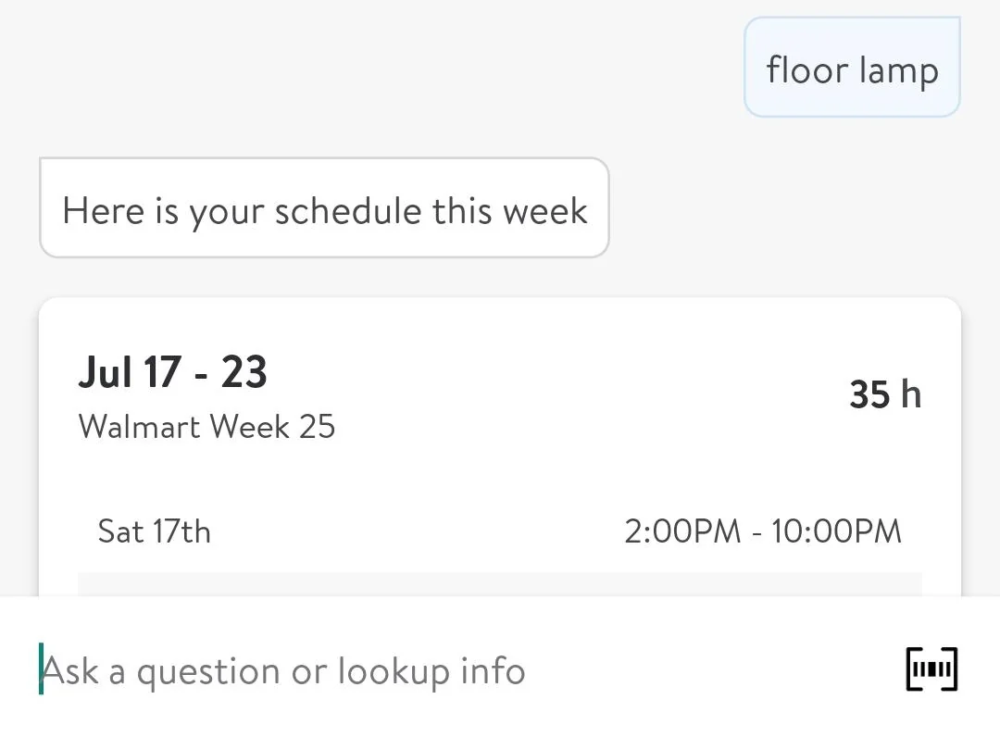<figcaption>
Calendar/Schedule Retrival
</figcaption></figure>

 

<figure>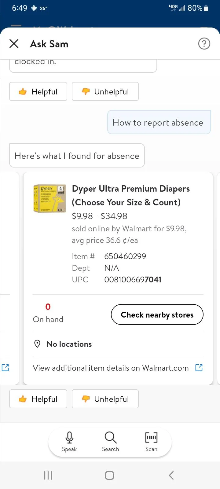<figcaption>
Search for Product 2
</figcaption></figure>

<figure>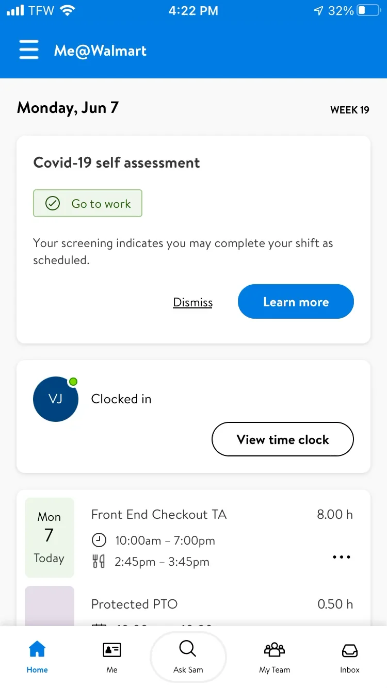<figcaption>
Covid Self Assessment
</figcaption></figure>

 

<figure>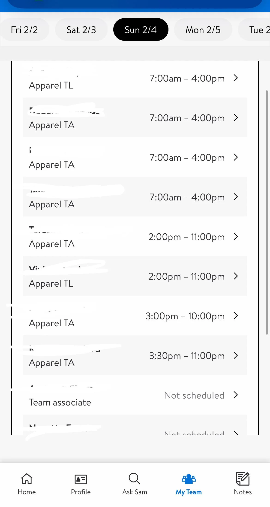<figcaption>
Team List
</figcaption></figure>

 

<figure>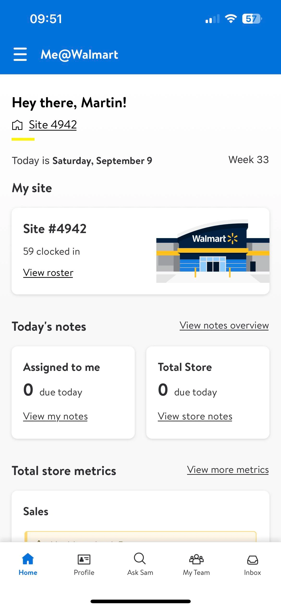<figcaption>
Store Shift Summary
</figcaption></figure>

 

<figure>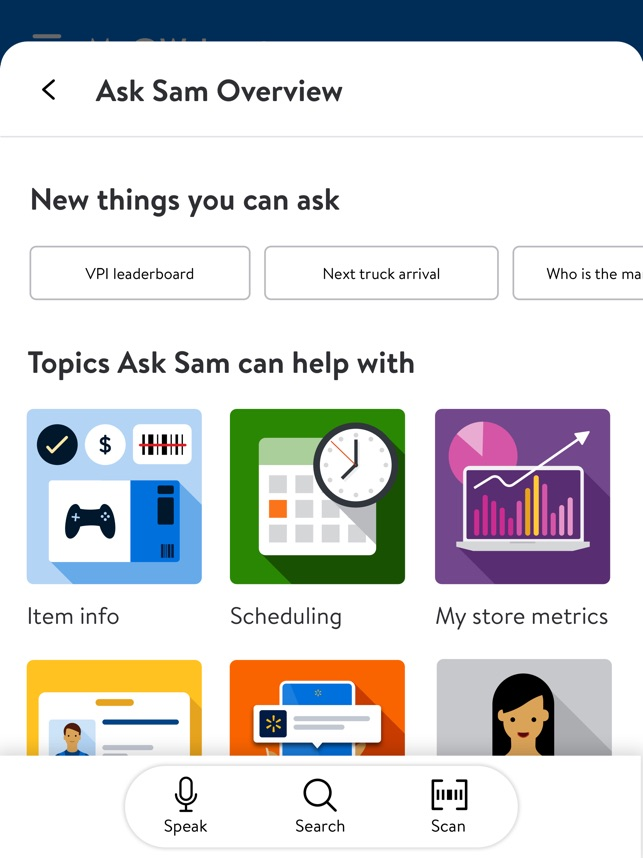<figcaption>
Feature List
</figcaption></figure>

