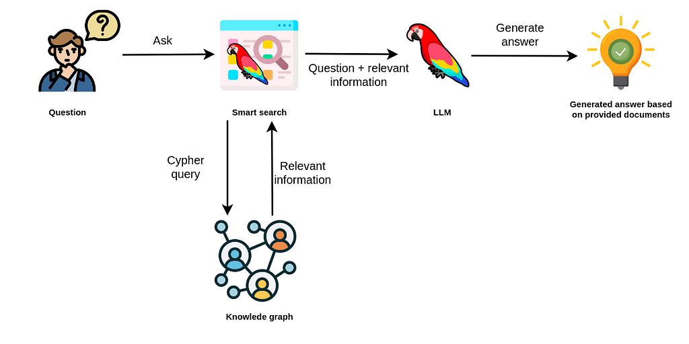

---
layout:
  title:
    visible: true
  description:
    visible: true
  tableOfContents:
    visible: true
  outline:
    visible: true
  pagination:
    visible: true
---

# KG + LLM

<figure><figcaption></figcaption></figure>



## Knowledge Graph Integration Strategies

### Knowledge Graph Embeddings

Represent entities and relations in the knowledge graph as dense vector embeddings, which can be incorporated into the language model’s input or output representations. This allows the model to capture and utilize relational knowledge during training or inference.\



<figure><figcaption></figcaption></figure>

<figure><figcaption></figcaption></figure>



* Tensor Factorization Models (TuckER, m-CP)&#x20;
* Hyperbolic Embeddings (MuRP, RotatE)
* Geometric Embeddings (RefE, BoxE)

### Knowledge Graph Augmentation

Augment the language model’s training data with knowledge graph triples, effectively teaching the model to better represent and reason over structured knowledge.\





### Knowledge Graph Retrieval

During inference, retrieve relevant knowledge graph subgraphs or facts based on the input text, and provide this structured knowledge as additional context to the language model.

### Knowledge-Grounded Generation

Develop language generation models that can directly generate text conditioned on knowledge graph facts, ensuring the generated output respects and accurately reflects the provided knowledge.

### Multi-Task Learning:

&#x20;Train language models on a combination of traditional language tasks (e.g., text generation, question answering) and knowledge graph tasks (e.g., link prediction, path ranking), enabling them to develop both language understanding and structured knowledge capabilities.

#### **Retrieval-Augmented Generation (RAG) with KG**

* **Vector-based retrieval:** This method of retrieval requires that you vectorize your KG and store it in a vector store. If you then vectorize your natural language prompt, you can find vectors in the vector store that are most similar to your prompt. Since these vectors correspond to entities in your graph, you can return the most ‘relevant’ entities in the graph given a natural language prompt. This is the exact same process described above under the tagging capability — we are essentially ‘tagging’ a prompt with relevant tags from our KG.
* **Prompt-to-query retrieval:** Alternatively, you could use an LLM to generate a SPARQL or Cypher query and use that query to get the most relevant data from the graph



## Knowledge Graph Reasoning Techniques 

### Path Ranking and Reasoning

Train language models to reason over multi-hop knowledge graph paths, enabling them to answer complex queries by traversing and combining multiple facts.

### Symbolic Reasoning

Incorporate symbolic reasoning capabilities into language models, allowing them to perform logical operations and inference over structured knowledge representations.

### Neuro-Symbolic Reasoning

Develop hybrid neuro-symbolic approaches that combine the strengths of neural networks (pattern recognition, generalization) and symbolic reasoning (interpretability, logical consistency).

### Knowledge Graph Attention

Develop attention mechanisms that can effectively attend to relevant knowledge graph entities and relations during language model inference, enabling more focused and contextualized knowledge utilization.

### Knowledge Graph Constraints

Enforce knowledge graph constraints (e.g., type constraints, cardinality constraints) during language model training or inference to ensure generated outputs respect the underlying knowledge graph structure and semantics.

### Knowledge Graph Refinement

Develop techniques to refine and extend knowledge graphs based on language model outputs, enabling a symbiotic relationship where the knowledge graph enhances the language model, and the language model, in turn, helps refine and expand the knowledge graph.

#### Automatic KG


Unveiling Strategies to Enhance LLMs through Knowledge Graphs


<figure><figcaption></figcaption></figure>



### Example - Stardog



<figure><figcaption></figcaption></figure>

