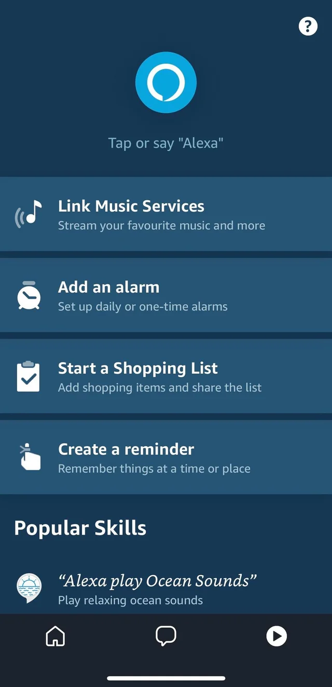
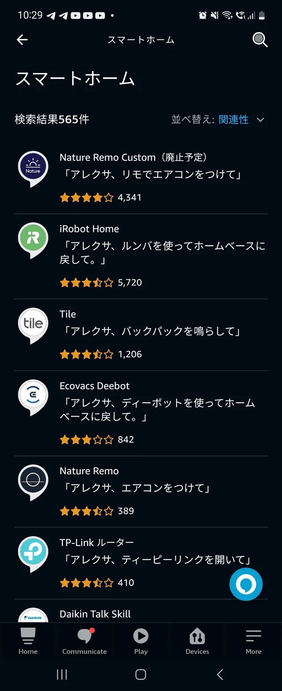
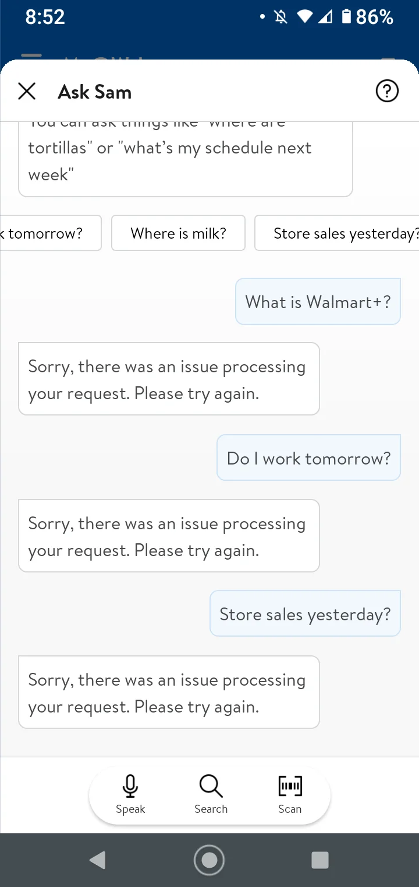
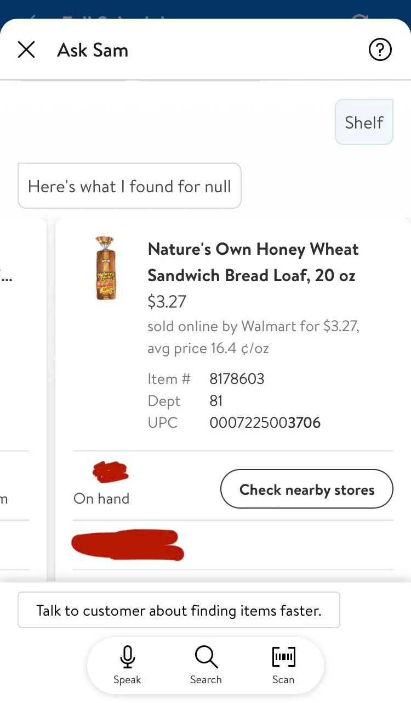
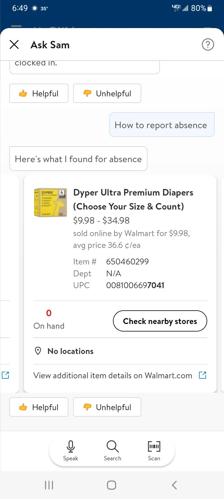
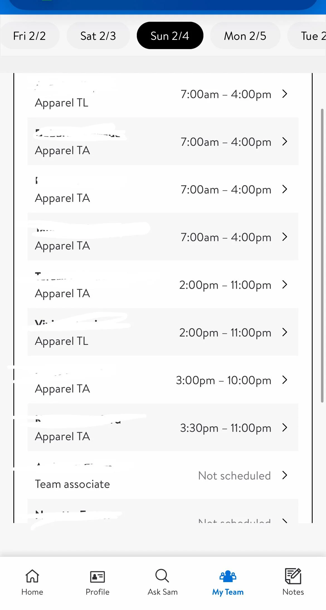
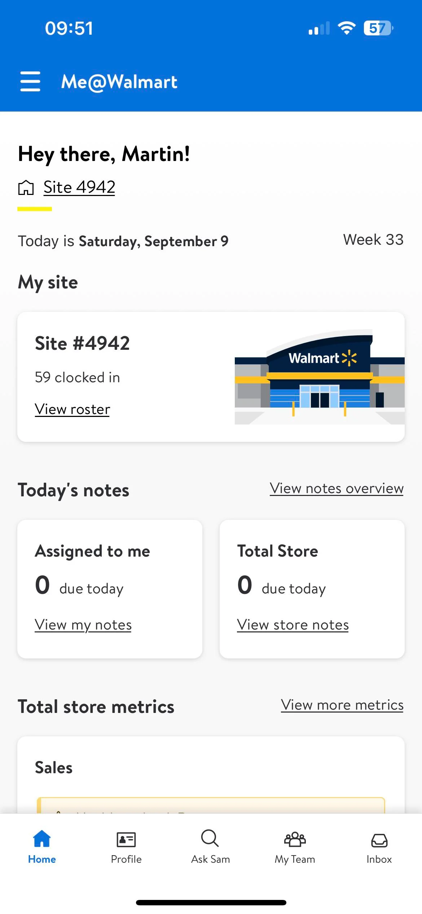

# Voice Assistant Interface Design Examples

## **Design Examples on** [**Figma**](https://www.figma.com/community)

<figure><figcaption>
By <a href="https://www.figma.com/@miquido">Miquido Design</a> and <a href="https://www.figma.com/@filryg">Filip Rygucki</a>
</figcaption></figure>

<figure><figcaption>
By <a href="https://www.figma.com/@uimrhraju">Mrh Raju</a>
</figcaption></figure>


By [Debiyaq](https://www.figma.com/@UiDiv)



By [Jaxit Chavda](https://www.figma.com/@Jecky)



By Alexandra Shleynova



By Bato Web Agency


## Browse Community Designs

Browse here for other App UI Templates

* [https://dribbble.com/](https://dribbble.com/)
* [https://www.figma.com/community](https://www.figma.com/community)
* [https://www.freepik.com/](https://www.freepik.com/)

## **Example Voice AI Platforms**

### Amazon Alexa


Video by Amazon Alexa


<figure><figcaption>
Alexa Skills and Interface
</figcaption></figure>

 

<figure><figcaption>
Suggested Prompts
</figcaption></figure>

 

<figure><figcaption>
Alexa Skill Store
</figcaption></figure>

<figure><figcaption>
Music, Weather, Shopping List Display
</figcaption></figure>

 

<figure><figcaption>
Home screen - Customizable
</figcaption></figure>

 

<figure><figcaption>
More Features List
</figcaption></figure>

### Microsoft Cortana



### Walmart Ask Sam


Video by CBS Philadelphia


[**Features:**](https://corporate.walmart.com/news/2020/07/29/helping-associates-succeed-at-work-while-elevating-customer-service-safety)

* Store Maps
* Price Look-up
* Product Locator
* Check Email
* Store Sales Information
* Printing
* Birthdays / Anniversaries

<figure><figcaption>
Text Conversation
</figcaption></figure>

 

<figure><figcaption>
Search for Product
</figcaption></figure>

 

<figure><figcaption>
Calendar/Schedule Retrival
</figcaption></figure>

 

<figure><figcaption>
Search for Product 2
</figcaption></figure>

<figure><figcaption>
Covid Self Assessment
</figcaption></figure>

 

<figure><figcaption>
Team List
</figcaption></figure>

 

<figure><figcaption>
Store Shift Summary
</figcaption></figure>

 

<figure><figcaption>
Feature List
</figcaption></figure>

### Bank of America - [Eria](https://promotions.bankofamerica.com/digitalbanking/mobilebanking/erica)

<figure><figcaption>
Suggested Infocards
</figcaption></figure>

 

<figure><figcaption>
Graphs and Diagrams
</figcaption></figure>

<figure><figcaption>
Features of Erica
</figcaption></figure>
