# McDonalds 麦当劳

## Menu Data

<figure><figcaption></figcaption></figure>


[McDelivery Menu Logger](https://github.com/schmwong/APAC-McDelivery-Menu-Logger?tab=readme-ov-file) 菜单清单

[Nutrition Information](https://www.kaggle.com/datasets/mcdonalds/nutrition-facts)  营养信息


## **User Flow**

**Step 1:** User Launches the App 用户启动应用 📱

* Open McDonald's mobile app
* App welcomes user and prompts for order

**Step 2:** Voice Activation 语音激活 🗣️

* User activates voice assistant ("Hey McDonald's")
* App listens for user command

**Step 3:** Menu Exploration 菜单浏览 🍔

<figure><figcaption></figcaption></figure>

* Voice assistant asks, "How can I assist you today?"
* User requests menu display
* App shows menu items using voice and visual interfaces
* Nutrition Facts: [https://www.kaggle.com/datasets/mcdonalds/nutrition-facts](https://www.kaggle.com/datasets/mcdonalds/nutrition-facts)

**Step 4:** Item Selection 商品选择 🥤

* User orders Big Mac meal and quantity
* Voice assistant confirms and asks for customization options
* User specifies preferences

**Step 5:** Customization and Personalization 定制和个性化 ✨

<figure><figcaption><p>Customization</p></figcaption></figure>

* Voice assistant suggests add-ons based on user's preferences
* User customizes meal further if desired

**Step 6:** Review and Confirm 审查和确认 ✔️

<figure><figcaption><p>Checkout Page</p></figcaption></figure>

* Voice assistant summarizes the order, including the quantity.
* User confirms or makes adjustments

**Step 7:** Payment and Delivery Options 付款和配送选项 💳

* Voice assistant asks for payment method
* User selects payment option
* If saved, app suggests default payment method
* User confirms payment

**Step 8:** Delivery Address 配送地址 🏠

* Voice assistant prompts for delivery address
* User provides address verbally or selects saved address

**Step 9:** Order Confirmation 订单确认 📦

* Voice assistant confirms order details
* User receives order number and notification

**Step 10:** Tracking and Updates 跟踪和更新 🚚

* App displays order status (e.g., "Preparing," "Out for Delivery," "Delivered")
* User tracks delivery progress in real-time

**Step 11:** Delivery or Pickup 交付或取货 🛍️

* For delivery: User notified when delivery arrives
* For pickup: App provides QR code for contactless pickup

**Step 12:** Enjoy the Meal! 享用美食 🍟

* User receives and enjoys delicious McDonald's meal

````mermaid

```mermaid
flowchart TD
    Step1([User Launches the App 📱])
    Step2[Voice Activation 🗣️]
    Step3[Menu Exploration 🍔]
    Step4{Item Selection 🥤}
    Step5{Customization✨}
    Step6{Confirm ✔️}
    Step7[Payment and Delivery Options 💳]
    Step8[Delivery Address 🏠]
    Step9[Tracking and Updates 🚚]
    Step10([Delivery or Pickup 🛍️])

    Step1 --> Step2
    Step2 --> Step3
    Step3 --> Step4
    Step4 --> Step5
    Step5 --> Step6
    Step6 --> Step7
    Step7 --> Step8
    Step8 --> Step9
    Step9 --> Step10
```

````

##

